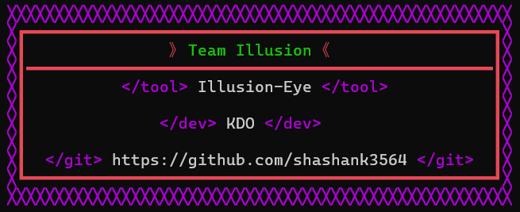

# 
Illusion-Eye || Version~1.0

**Illusion-Eye:** An OSINT Tool Framework, Developed by ***Team Illusion***, a group of hackers,developers, and programmers, ***Illusion-Eye*** is an Open Source Intelligence (OSINT) tool framework. The team's motto, ***"We do with reason, Everything is an illusion"***,  reflects their commitment todeveloping tools and software with a purpose.

## Illusion-Eye Version 1.0

 - ***Wordpress Admin Finder***: Peel back the layers
   of Wordpress sites and reveal the shadowy
   figures behind the admin usernames.

 - ***IP Information Gathering***: Unveil the secrets
   concealed within IP addresses. Illusion-Eye's
   robust gathering tool lets you extract
    valuable information from the digital ether.

## Team Illusion's Mission
 ***Team Illusion's*** primary aim is to develop
 tools and software that serve a purpose.
 They believe in doing things with reason, and
 their work in creating ***Illusion-Eye***
 exemplifies this philosophy. Their commitment
 to creating practical, useful tools
 contributes to the broader ***cybersecurity***
 community and aids in maintaining robust
 security practices.

 ***Please note that*** while OSINT tools like
 ***Illusion-Eye*** can be powerful resources
 for ***ethical hacking*** and ***cybersecurity***,
 they should be used responsibly and ethically.
 Misuse of such tools can lead to legal
 consequences and is strongly discouraged.
 Always obtain proper ***authorization*** before
 conducting any ***penetration testing*** or
 ***vulnerability assessments***.

## System Support and Installation Process for Illusion-Eye
**System Support:** 
Illusion-Eye Version 1.0 is designed to provide comprehensive OSINT capabilities on Windows operating systems. Here's what you need to know about system support:

 - Windows Compatibility: Illusion-Eye Version 1.0 is fully compatible with various 
 - Windows operating systems, including Windows 8, 10, and 11.
    Minimum System Requirements: To ensure smooth performance, it's recommended to have a system with moderate specifications, including a decent processor, sufficient RAM, and ample storage space.

**Installation Process:**
 - Step 1: Download Python 3.12+
    * Before installing Illusion-Eye, you'll need to download and install Python 3.12 or a later version. 
    * Visit the official Python website and download the latest version compatible with your Windows operating system.
 - Step 2: Install Python
    * Once the Python installer is downloaded, double-click on it to launch the installation wizard.
    * Follow the on-screen instructions provided by the Python installer to complete the installation process.
 - Step 3: Download Illusion-Eye 
    * `https://github.com/shashank3564/Illusion-Eye/archive/refs/heads/main.zip`
 - Step 4: Extract Files
    * Once the download is complete, navigate to the downloaded file and extract its contents using a file extraction tool such as WinRAR or 7-Zip.
 - Step 5: Register User and Activate Product Key
    * If you've already registered a username and activated a product key, proceed to Step 6.
    * If not, run the Register.py script included in the Illusion-Eye folder to register your username. If you don't have a product key, contact the developer to purchase one.
 - Step 6: Run Main Application
    * Once your username is registered, navigate to the Illusion-Eye folder.
    * Alternatively, open a command prompt, navigate to the Illusion-Eye folder using the cd command, and run `python main.py` to launch the application.

## Disclaimer
Usage of ***Illusion-Eye*** for any ***malicious or unauthorized activities*** is strictly prohibited. The ***developers of Illusion-Eye and the Team Illusion*** are not responsible for any damage, loss, or misuse of this tool. It is the responsibility of the user to comply with all applicable laws and regulations while using this Tool.***

## Legal Notice
***Illusion-Eye*** is intended to be used for ethical and legal purposes, such as security testing and educational endeavors. Any misuse or illegal use of this tool is not condoned. Team Illusion and the developers of Illusion-Eye bear no responsibility for any illegal, unethical, or unauthorized activities performed by users of this tool. Furthermore, ***if any user is found to misuse this tool, we reserve the right to take legal action against them to the fullest extent permitted by law***. It is imperative that users exercise caution, responsibility, and discretion when utilizing ***Illusion-Eye*** to ensure compliance with all applicable laws and regulations.

## Visiter
